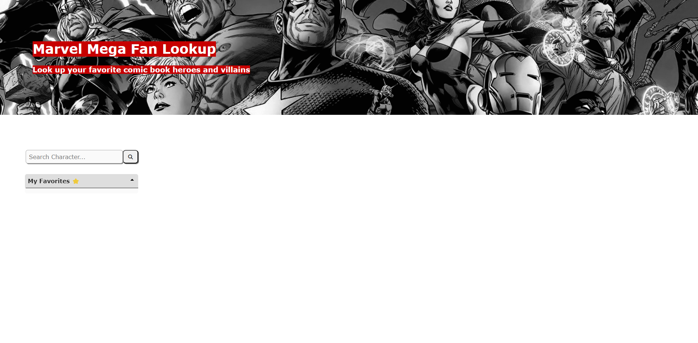
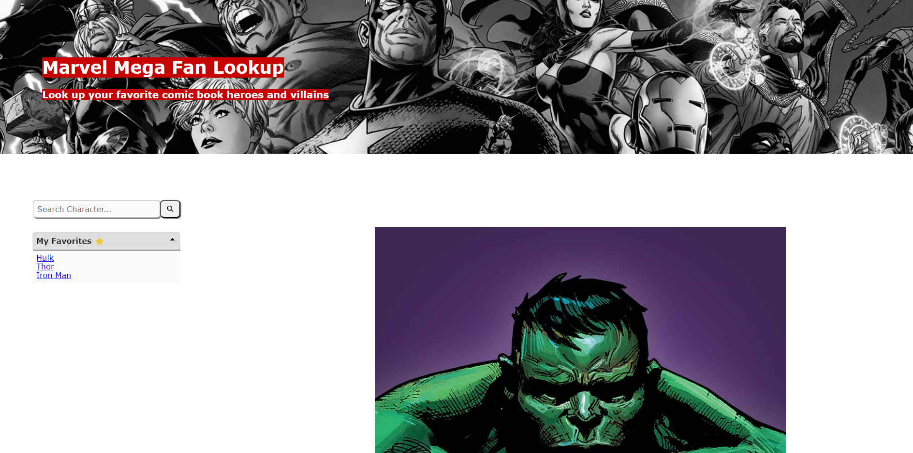
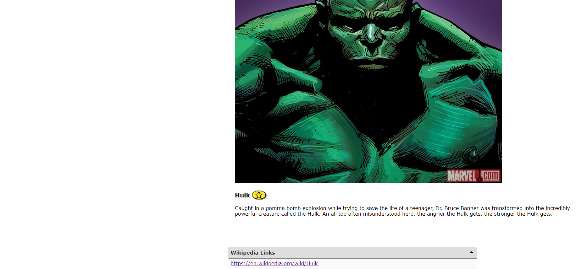

# Marvel Mega Fan Look-up
Using APIs create a site to look up Marvel characters and their wikipedia sites.  

## Description
We have an appreciation for Marvel characters but understand that the Marvel website alone may not include all of the information that an external unbiased website like Wikipedia may have.  This application combines the best of both worlds for us, by engaging the Marvel and Wikimedia APIs at the same time and providing the option to visit both from the same location.  Never again will we search multiple sites at once for character information.  This allows the user more time for the truly important research.  Our group learned how to implement an alternative CSS framework, use different methods to work with the fetch results from third party servers, and how to collaborate while coding using Github features and branches for our code, with main protected.  

## Usage and Installation

Visit addlinkhere.  No installation steps required.

Identify and select the search input field.  Think of your favorite Marvel character (villain or hero) and enter their name in the search field.  If your character yields any results, a card will appear that includes their photo from Marvel.com and the link to that character's Wikipedia article.  By selecting the link you can visit the Wikipedia article.

Initial Page:  
  

Page with result:  
  
  

## Credits

Danielle LeBrun - https://github.com/DMB-LEB 
Trevor Blanchard - https://github.com/blanchardt
Jeremiah Richardson - https://github.com/jeremiahthegreat1

Third Party APIs Used:
MediaWiki - https://www.mediawiki.org/wiki/API:Properties#
Marvel - https://developer.marvel.com

Nicole Thomas - https://github.com/nthomas88  
Nicole provided assistance with teaching the material as well as assistance on a specific hash concern for the Marvel API and an api link concern for the MediaWiki API.  

link to GitHub repo - https://github.com/blanchardt/Group-Marvel-Mega-Fan-Lookup  
link to live site - https://blanchardt.github.io/Group-Marvel-Mega-Fan-Lookup/  

https://stackoverflow.com/questions/1655769/fastest-md5-implementation-in-javascript to figure out how to use the MD5 function, referenced on line 24-36 in script.js file.   
powtac, Matt Baker, theCodeMachine, Tyler Liu, dkellner, Shital Shah, Szabolcs Dombi, Zibri, ez2, Dr.YSG, gtournie,    
&nbsp;&nbsp;&nbsp;&nbsp;&nbsp;brillout, R. Hill, emn178, eustatos, av01d, Francis, Bobík, user42507, … Mario Steinitz. (2009, October 31).   
&nbsp;&nbsp;&nbsp;&nbsp;&nbsp;Fastest MD5 implementation in JavaScript. Stack Overflow. https://stackoverflow.com/questions/1655769/fastest-md5-    
&nbsp;&nbsp;&nbsp;&nbsp;&nbsp;implementation-in-javascript  

https://bobbyhadz.com/blog/javascript-remove-first-n-characters-from-string to figure out how to remove the first 4 characters of a string, referenced on line 153-156 in script.js file.    
Hadzhiev, B. (2023, January 5). Remove the first N characters from a string in JavaScript. bobbyhadz.    
&nbsp;&nbsp;&nbsp;&nbsp;&nbsp;https://bobbyhadz.com/blog/javascript-remove-first-n-characters-from-string   

## License

MIT License

Copyright (c) 2023 blanchardt

Permission is hereby granted, free of charge, to any person obtaining a copy
of this software and associated documentation files (the "Software"), to deal
in the Software without restriction, including without limitation the rights
to use, copy, modify, merge, publish, distribute, sublicense, and/or sell
copies of the Software, and to permit persons to whom the Software is
furnished to do so, subject to the following conditions:

The above copyright notice and this permission notice shall be included in all
copies or substantial portions of the Software.

THE SOFTWARE IS PROVIDED "AS IS", WITHOUT WARRANTY OF ANY KIND, EXPRESS OR
IMPLIED, INCLUDING BUT NOT LIMITED TO THE WARRANTIES OF MERCHANTABILITY,
FITNESS FOR A PARTICULAR PURPOSE AND NONINFRINGEMENT. IN NO EVENT SHALL THE
AUTHORS OR COPYRIGHT HOLDERS BE LIABLE FOR ANY CLAIM, DAMAGES OR OTHER
LIABILITY, WHETHER IN AN ACTION OF CONTRACT, TORT OR OTHERWISE, ARISING FROM,
OUT OF OR IN CONNECTION WITH THE SOFTWARE OR THE USE OR OTHER DEALINGS IN THE
SOFTWARE.

---